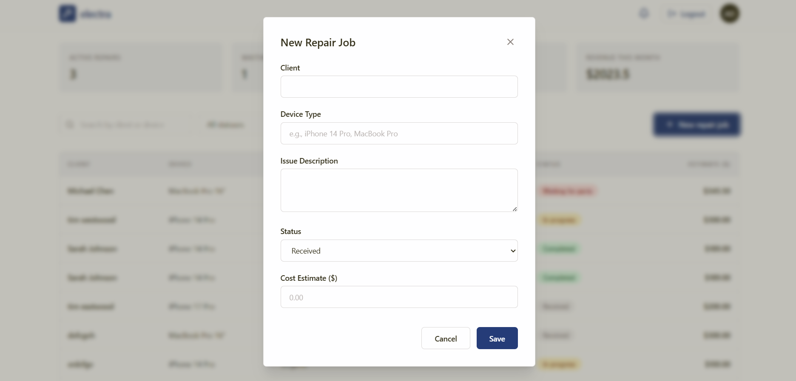
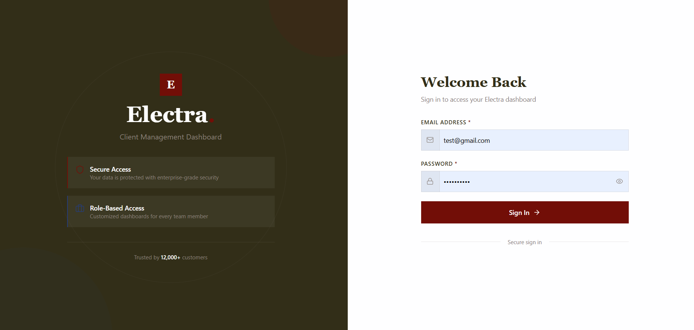
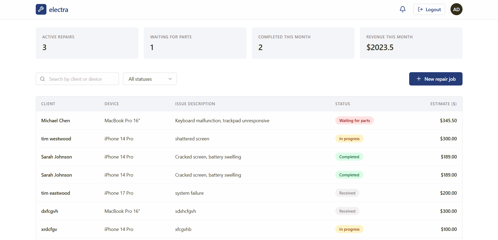

# Electra Repair Management System

A modern full-stack repair shop management platform that simplifies the entire repair workflow—from customer appointment booking to repair tracking and administrative management.

Electra enables customers to submit repair requests through an intuitive interface while providing administrators with a powerful dashboard to monitor repairs, appointments, customers, and service progress in real time.

---

## Overview

Electra was built to digitize and streamline the workflow of an electronics repair business. Instead of relying on manual records, phone calls, or paper schedules, the system centralizes customer management, appointment booking, repair tracking, and administrative operations into one responsive web application.

Whether you're managing a small repair shop or planning to extend the system into a larger service platform, Electra provides a scalable foundation built with modern web technologies.

---

# Features

## Customer Features

- Secure authentication
- User-friendly landing page
- Online repair appointment booking
- Responsive design
- Contact page
- Service overview
- Pricing information
- Modern animated interface

---

## Administrator Features

- Secure administrator login
- Dashboard overview
- Appointment management
- Repair management
- Customer management
- Search functionality
- Status updates
- Email notifications
- Protected routes
- Session-based authentication

---

# 🛠 Technology Stack

## Frontend

- React
- Vite
- React Router
- Axios
- Tailwind CSS
- Framer Motion
- Lucide React

---

## Backend

- Node.js
- Express.js
- PostgreSQL
- Passport.js
- Express Session
- bcryptjs
- Nodemailer

---

## Database

- PostgreSQL

---

# Architecture

```
React Frontend
       │
       │ Axios Requests
       ▼
Express REST API
       │
Passport Authentication
       │
       ▼
PostgreSQL Database
       │
       ▼
Repair Records
Appointments
Users
Admin Data
```

---

# Project Structure

```
Electra-Repair-Management-System

├── client
│   ├── public
│   ├── src
│   │   ├── assets
│   │   ├── components
│   │   ├── App.jsx
│   │   └── main.jsx
│   ├── package.json
│   └── vite.config.js
│
├── server
│   ├── database
│   ├── middleware
│   ├── routes
│   ├── package.json
│   ├── server.js
│   └── .env.example
│
├── README.md
├── LICENSE
└── .gitignore
```

---

# Getting Started

## Prerequisites

Install the following software before running the project:

- Node.js (v18 or later)
- npm
- PostgreSQL
- Git

---

## Clone the Repository

```bash
git clone https://github.com/Elroi101/Electra-Repair-Management-System.git

cd Electra-Repair-Management-System
```

---

# Install Dependencies

## Frontend

```bash
cd client

npm install
```

---

## Backend

```bash
cd server

npm install
```

---

# Environment Variables

Create a `.env` file inside the server directory.

```env
PORT=3000

DB_HOST=localhost

DB_PORT=5432

DB_USER=postgres

DB_PASSWORD=your_password

DB_NAME=electra_db

SESSION_SECRET=your_session_secret

EMAIL_USER=your_email

EMAIL_PASS=your_password
```

---

# Database Setup

Create a PostgreSQL database.

Example:

```sql
CREATE DATABASE electra_db;
```

Import the SQL schema included with the project (or create the required tables manually if you're using your own schema).

---

# Running the Application

## Start the Backend

```bash
cd server

npm start
```

or

```bash
npm run dev
```

---

## Start the Frontend

```bash
cd client

npm run dev
```

Open:

```
http://localhost:5173
```

---

# Authentication

Electra uses:

- Passport.js
- Express Sessions
- bcrypt password hashing
- Protected Routes
- Role-based access for administrators

---

# API Overview

## Authentication

| Method | Endpoint | Description       |
| ------ | -------- | ----------------- |
| POST   | /login   | Authenticate user |
| POST   | /logout  | End user session  |

---

## Appointments

| Method | Endpoint          | Description           |
| ------ | ----------------- | --------------------- |
| GET    | /appointments     | Retrieve appointments |
| POST   | /appointments     | Create appointment    |
| PUT    | /appointments/:id | Update appointment    |
| DELETE | /appointments/:id | Delete appointment    |

---

## Repairs

| Method | Endpoint     | Description      |
| ------ | ------------ | ---------------- |
| GET    | /repairs     | Retrieve repairs |
| POST   | /repairs     | Add repair       |
| PUT    | /repairs/:id | Update repair    |
| DELETE | /repairs/:id | Remove repair    |

---

# Screenshots

## Homepage

> 

```
screenshots/homepage.png
```

---

## Booking Page

> 

```
screenshots/booking.png
```

---

## Login Page

> 

```
screenshots/login.png
```

---

## Dashboard

> 

```
screenshots/dashboard.png
```

---

## Repair Management

> _(Insert screenshot here)_

```
screenshots/repair-management.png
```

---

# Future Improvements

- Customer dashboard
- Repair timeline tracking
- SMS notifications
- Payment integration
- Online invoices
- Technician management
- Analytics dashboard
- Inventory management
- File uploads for damaged devices
- Dark mode

---

# Contributing

Contributions are welcome!

1. Fork the repository.

2. Create a feature branch.

```bash
git checkout -b feature/new-feature
```

3. Commit your changes.

```bash
git commit -m "Add new feature"
```

4. Push the branch.

```bash
git push origin feature/new-feature
```

5. Open a Pull Request.

---

# License

This project is licensed under the MIT License.

---

# Author

**Elroi101**

GitHub: https://github.com/Elroi101

---

# Support

If you found this project useful, consider giving it a **⭐ Star** on GitHub. It helps others discover the project and supports future development.

Thank you for checking out **Electra Repair Management System**!
